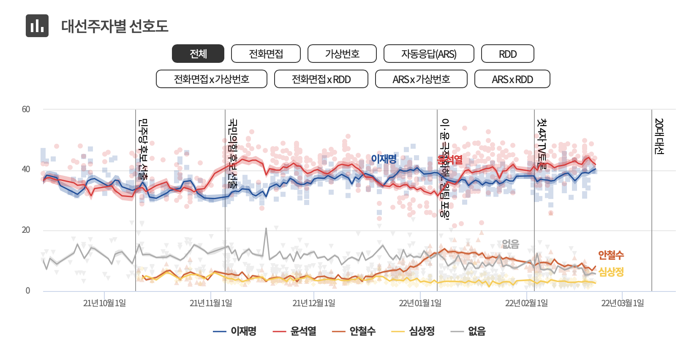
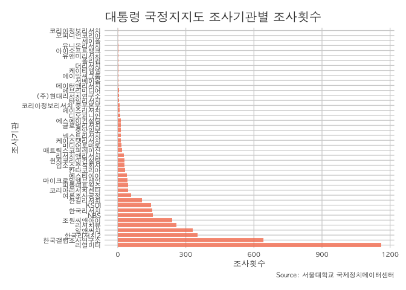
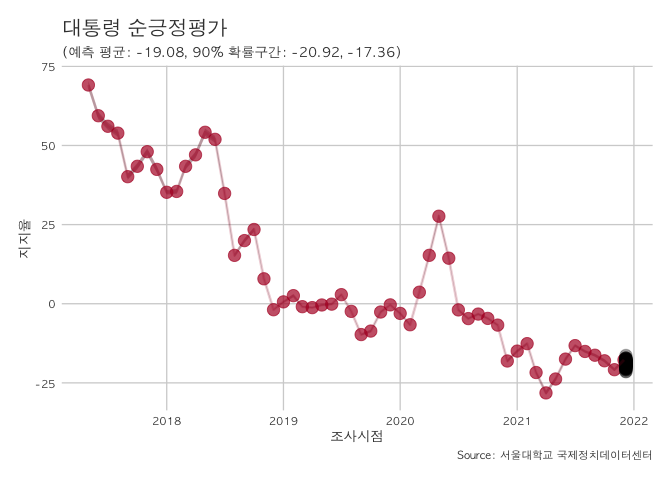
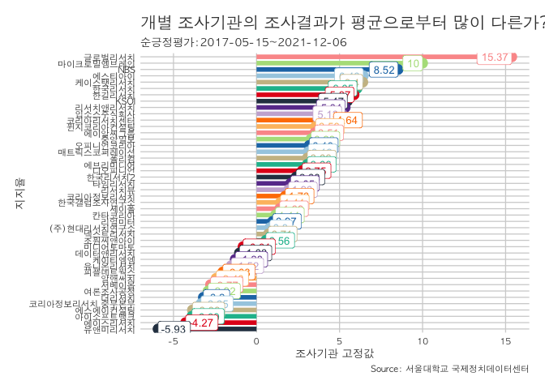
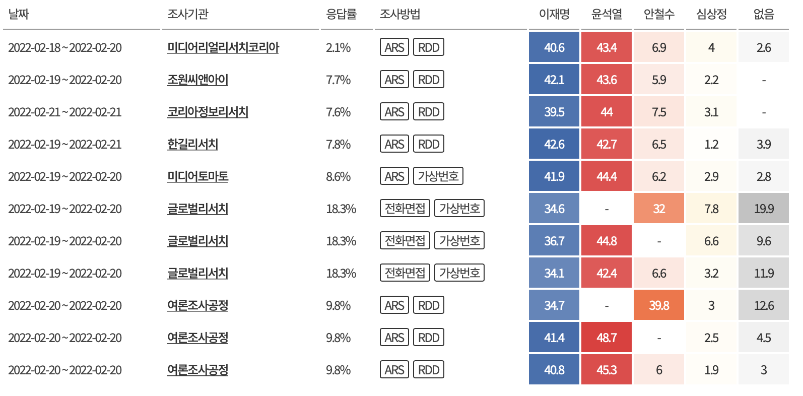

<!-- README.md is generated from README.Rmd. Please edit that file -->

# Poll-MBC

 이 깃허브는 MBC 여론조사를
조사하다(<http://poll-mbc.co.kr/)에서> 사용된 코드를 설명하고 공개하는 것을 목적으로 합니다.
이 코드를 돌리기 위해서는 jags(Just Another Gibbs Sampler,
<https://mcmc-jags.sourceforge.io)가> 설치되어 있어야 합니다.

## Load packages

``` r
require(rjags)
#> Loading required package: rjags
#> Loading required package: coda
#> Linked to JAGS 4.3.0
#> Loaded modules: basemod,bugs
require(rlist)
#> Loading required package: rlist
require(jsonlite)
#> Loading required package: jsonlite
require(haven) ## for as_factor
#> Loading required package: haven
require(forcats) ## for fct_reorder
#> Loading required package: forcats
require(tidyquant)
#> Loading required package: tidyquant
#> Loading required package: lubridate
#> 
#> Attaching package: 'lubridate'
#> The following objects are masked from 'package:base':
#> 
#>     date, intersect, setdiff, union
#> Loading required package: PerformanceAnalytics
#> Loading required package: xts
#> Loading required package: zoo
#> 
#> Attaching package: 'zoo'
#> The following objects are masked from 'package:base':
#> 
#>     as.Date, as.Date.numeric
#> 
#> Attaching package: 'PerformanceAnalytics'
#> The following object is masked from 'package:graphics':
#> 
#>     legend
#> Loading required package: quantmod
#> Loading required package: TTR
#> Registered S3 method overwritten by 'quantmod':
#>   method            from
#>   as.zoo.data.frame zoo
#> Version 0.4-0 included new data defaults. See ?getSymbols.
#> ══ Need to Learn tidyquant? ════════════════════════════════════════════════════
#> Business Science offers a 1-hour course - Learning Lab #9: Performance Analysis & Portfolio Optimization with tidyquant!
#> </> Learn more at: https://university.business-science.io/p/learning-labs-pro </>
require(ggplot2)
require(dplyr)
#> Loading required package: dplyr
#> 
#> Attaching package: 'dplyr'
#> The following objects are masked from 'package:xts':
#> 
#>     first, last
#> The following objects are masked from 'package:stats':
#> 
#>     filter, lag
#> The following objects are masked from 'package:base':
#> 
#>     intersect, setdiff, setequal, union
require(ggthemes)
#> Loading required package: ggthemes
require(readxl)
#> Loading required package: readxl
```

## Load data

``` r
df <- read_excel("president.xlsx")
#> New names:
#> * `` -> ...1
df
#> # A tibble: 4,076 × 67
#>    ...1  index day                 house house_new    GG    BH  Soso Great  Good
#>    <chr> <chr> <dttm>              <chr> <chr>     <dbl> <dbl> <dbl> <dbl> <dbl>
#>  1 1     3765  2017-05-15 00:00:00 리얼… 리얼미터   NA    NA    NA    53.4  28.9
#>  2 2     3765  2017-05-16 00:00:00 리얼… 리얼미터   NA    NA    NA    53.4  28.9
#>  3 3     3765  2017-05-17 00:00:00 리얼… 리얼미터   NA    NA    NA    53.4  28.9
#>  4 4     3765  2017-05-18 00:00:00 리얼… 리얼미터   NA    NA    NA    53.4  28.9
#>  5 5     3765  2017-05-19 00:00:00 리얼… 리얼미터   NA    NA    NA    53.4  28.9
#>  6 6     3768  2017-05-20 00:00:00 리서… 리서치뷰   NA    NA    NA    67.4  19.6
#>  7 7     3768  2017-05-21 00:00:00 리서… 리서치뷰   NA    NA    NA    67.4  19.6
#>  8 8     3768  2017-05-22 00:00:00 리서… 리서치뷰   NA    NA    NA    67.4  19.6
#>  9 9     3770  2017-05-20 00:00:00 조원… 조원씨앤…  81.3   8.8   7.5  NA    NA  
#> 10 10    3770  2017-05-21 00:00:00 조원… 조원씨앤…  81.3   8.8   7.5  NA    NA  
#> # … with 4,066 more rows, and 57 more variables: Bad <dbl>, Horrible <dbl>,
#> #   DK <dbl>, total <dbl>, election <chr>, region1 <chr>, election_name <chr>,
#> #   client <chr>, house.detail <chr>, region2 <chr>, date <dttm>, hours <chr>,
#> #   subject <chr>, weight_method <chr>, weight_application <chr>,
#> #   a_weight_method <chr>, a_weight_application <chr>, intertval <chr>,
#> #   media_type <chr>, media <chr>, release_date <chr>, rejection <dbl>,
#> #   response <dbl>, reach <dbl>, whole_reach_rate <lgl>, …
```

## type of approval data

여기서 우리는 순긍정평가(candidate = 4)만 분석할 것이다.

``` r
candidate.list <- c("y1", "y2", "y3", "y4")
n.candidate <- length(candidate.list)
candidate.names <- c("good", "bad", "dk", "net_good")
candidate.korea <- c("긍정평가", "부정평가", "모름", "순긍정평가")
candidate <- 4
tune <- 1 ## tuning parameter 
sigma.tune <- 1 ## tuning parameter for sigma
sigma.low = 0
sigma.high = 1
```

## model fitting input check

``` r
model.name <- paste0("president_approve_", candidate.korea[candidate])
subdata <- df[!is.na(unlist(df[, candidate.list[candidate]])), ]

## house rename
subdata$house.new <- subdata$house_new
subdata$house.new <- sapply(subdata$house.new,
                                function(x){as.factor(toString(x))})
n.house <- length(unique(subdata$house.new))
house.name <- unique(subdata$house.new)
house.id <- as.numeric(subdata$house.new)
house.freq <- table(subdata$house.new) %>% 
        as.data.frame() %>% 
        arrange(house.name)
        
## report 
cat("\t", model.name, " House number is ", n.house, "\n")
#>   president_approve_순긍정평가  House number is  44
```

## 조사기관 빈도 체크

``` r
options(repr.plot.width=8, repr.plot.height=3)
subdata %>% group_by(house.new) %>% summarise(n = n()) %>% 
  mutate(house.new = fct_reorder(house.new, desc(n))) %>%
  ggplot(aes(x = house.new , y = n, main="조사기관")) +
         geom_bar(stat = "identity", fill="#f68060", alpha=.8, width=.8) +
         coord_flip() + 
  scale_y_continuous(name="조사횟수") +
  scale_x_discrete(name="조사기관") +
  theme(axis.text.x = 
        element_text(face="bold", color="#008000",
                   size=8, angle=0),
        axis.text.y = element_text(face="bold", color="#008000",
                   size=8, angle=0)) + 
  labs(title = "대통령 국정지지도 조사기관별 조사횟수", 
       caption = "Source: 서울대학교 국제정치데이터센터")+
  theme_jhp()
```



## model fitting (5 chains and 1000 mcmc runs)

``` r
subdata$y <- as.numeric(unlist(subdata[, candidate.list[candidate]]))
subdata$date <- as.Date(as.character(subdata$start.date))
Date <- sort(unique(subdata$date))
numeric.date <- as.numeric(as.factor(as.numeric(subdata$date) -
                                     sort(as.numeric(subdata$date))[1] + 1))
n.period <- length(Date)
N.obs <- length(subdata$y)
df.jags <- data.frame(y = subdata$y, date = subdata$date,
                      size = subdata$response)
df.jags$Date <- numeric.date
df.jags <- df.jags[order(df.jags$Date),]
df.jags$sd <- sd(df.jags$y)
df.jags$var <- var(df.jags$y)
df.jags$lo <- df.jags$y - 1.96*df.jags$sd[1]
df.jags$up <- df.jags$y + 1.96*df.jags$sd[1]
mean.y <- sapply(1:n.period, function(i){mean(df.jags$y[df.jags$Date == i])})
survey.count <- sapply(1:n.period, function(i){length(df.jags$y[df.jags$Date == i])})
var.y.raw <- (df.jags$y^2)/df.jags$size
var.y <- sapply(1:n.period, function(j){mean(var.y.raw[df.jags$Date == j], na.rm=TRUE)})
var.y <-  ifelse(is.na(var.y)|var.y==0, mean(var.y, na.rm=TRUE), var.y)
sigma.upper <- sd(df.jags$y)/sigma.tune

a01 <- mean.y[1] - tune*1.96*df.jags$sd[1]
a02 <- min(100, mean.y[1] + tune*1.96*df.jags$sd[1])

jags.data <- list(y=df.jags$y, prec=1/var.y, numeric.date=numeric.date,
            house.id=house.id, N.obs = N.obs, n.period=n.period, n.house=n.house,
            sigma.low = sigma.low, sigma.high = sigma.high, a01 = a01, a02 = a02,
            alpha= rep(NA, n.period), new.alpha = NA)
cat("\t", model.name, " model is ready to run!\n")
#>   president_approve_순긍정평가  model is ready to run!
model <- jags.model("mbc_house.bug",
                  data = jags.data, n.chains = 5, n.adapt=1000)
#> Compiling model graph
#>    Resolving undeclared variables
#>    Allocating nodes
#> Graph information:
#>    Observed stochastic nodes: 4072
#>    Unobserved stochastic nodes: 915
#>    Total graph size: 15385
#> 
#> Initializing model
output1 <- coda.samples(model=model,
                      variable.names=c("alpha","house","sigma", "new.alpha"),
                      n.iter=1000, thin=5)
output <- list.rbind(output1)
coef.names <- colnames(output)
```

## See the results

``` r
    cat(model.name, " visualization and save !\n")
#> president_approve_순긍정평가  visualization and save !
    
    alphaFirst <- output[,grep("alpha\\[", coef.names)]
    new.alphaFirst  <- output[,grep("new.alpha", coef.names)]
    
    sigmaFirst <- output[,grep("sigma", coef.names)]
    houseFirst <- output[,grep("house", coef.names)]
    alpha.bar <- apply(alphaFirst,2,mean)
    alpha.ci <- apply(alphaFirst, 2, quantile,c(.025,.975))
    new.alphaFirst.bar <- mean(new.alphaFirst)
    new.alphaFirst.ci <- quantile(new.alphaFirst, probs=c(.025,.975))
    houseEffects <- apply(houseFirst,2,mean)

    df.gg <- data.frame(date = Date,
                        mean = ifelse(alpha.bar<0, 0, alpha.bar),
                        lower = ifelse(alpha.ci[1,]<0, 0, alpha.ci[1,]),
                        upper = ifelse(alpha.ci[2,]<0, 0, alpha.ci[2,]))
    df_obs <- data.frame(date = Date, y = alpha.bar)
    df_obs_low <- data.frame(date = Date, y = alpha.ci[1,])
    df_obs_high <- data.frame(date = Date, y = alpha.ci[2,])
    df_month <-  aggregate(df_obs$y, list(format(df_obs$date, "%Y-%m-01")), mean)
    colnames(df_month) <- c("date", "mean")
    df_month$date <- as.Date(df_month$date)
    df_month$low <- aggregate(df_obs_low$y, list(format(df_obs$date, "%Y-%m-01")), mean)$x
    df_month$upper <- aggregate(df_obs_high$y, list(format(df_obs$date, "%Y-%m-01")), mean)$x

    good.news.prob <- mean(new.alphaFirst > 50)
    good.news.ci <- quantile(new.alphaFirst , probs=c(0.05, 0.95))

    G <- 100
    df.pred <- data.frame(date = as.Date(rep(df.gg$date[nrow(df.gg)]+1, 100)),
                          mean = new.alphaFirst[sample(1:nrow(alphaFirst), size=100)])
```

## trend line

``` r
gg.df <- df.gg %>% ggplot(aes(x = date, y = mean)) +
        geom_ribbon(data = df_month, aes(ymin=low,ymax=upper),alpha=0.3) +
        geom_point(data = df_month, 
                   col = "#b2182b", alpha=0.7, size = 4) +
        ## geom_point(alpha = .65, size = 2) +
        geom_point(data =df.pred , 
                   col = "black", alpha=0.2, size = 4) +
        geom_line(data = df_month, 
                  col = "#b2182b", alpha=0.2, size = 1) + 
        theme(panel.grid.minor = element_blank(), legend.position="bottom", 
              plot.subtitle = element_text(size = 20)) + 
        labs(title= paste0("대통령 ", candidate.korea[candidate]),
             caption = "Source: 서울대학교 국제정치데이터센터",
             subtitle = paste0("(예측 평균: ", 
                               round(mean(new.alphaFirst), 2), ", 90% 확률구간: ",
                               round(good.news.ci, 2)[1], ", ", 
                               round(good.news.ci, 2)[2], ")"),
             y = "지지율", x="조사시점") + theme_jhp()
gg.df
```



## house effects plot

``` r
   houseEffects <- apply(houseFirst,2,mean)
    houseci <- apply(houseFirst,2,quantile,c(.025,.975))
    lower= round(houseci[1,], 2)
    upper= round(houseci[2,], 2)
    names(houseEffects) <- house.name
    houseName <- house.name
    names(houseEffects) <- sort(houseName)
    df.house <- data.frame(name = sub("\\..*", "", house.name),
                           bias = round(houseEffects, 2),
                           lower= round(houseci[1,], 2),
                           upper= round(houseci[2,], 2),
                           sign = ifelse(houseEffects>0&lower>0&upper>0,
                                         "positive",
                                  ifelse(houseEffects<0&lower<0&upper<0, "negative", "mixed")))
    
    df.house <- df.house %>% arrange(bias) 
    g1 <- df.house %>% ## filter(sign == "positive")%>%
        mutate(function_name = as_factor(name) %>% fct_reorder(bias)) %>%
        arrange(desc(function_name)) %>%
        ggplot(aes(x = bias, y = function_name, color = function_name)) +
        geom_segment(aes(xend = 0, yend = function_name), size = 2) +
        geom_point(size = 4) +
        geom_label(aes(label = round(bias, 2)), 
                   hjust = "inward", size = 3.5) +
        expand_limits(x = 0) +
        labs(
            title = paste0("개별 조사기관의 조사결과가 평균으로부터 많이 다른가?"),
            subtitle = paste0(candidate.korea[candidate], ":",
                              range(df$start.date)[1], "~", range(df$start.date)[2]),
            caption = "Source: 서울대학교 국제정치데이터센터",
            y = "지지율", x="조사기관 고정값") + 
        scale_color_tq() +
        theme_jhp() +
        theme(legend.position = "none") 
g1
```




